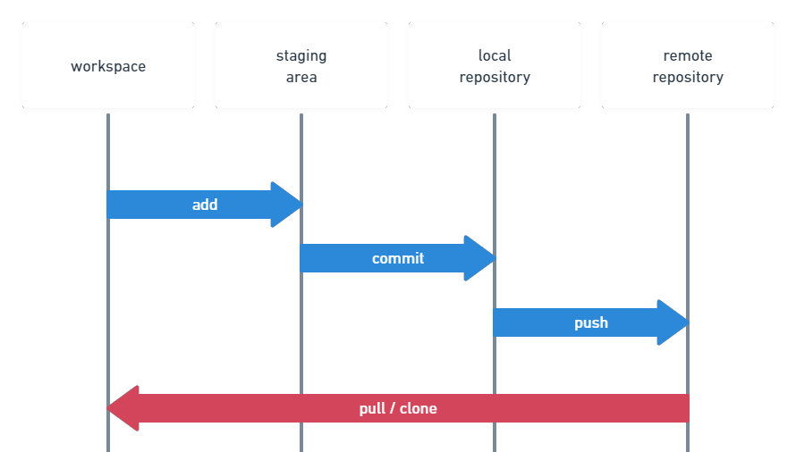

## Git & GitHub

### 개념 정의

- **Git**: 소스 코드와 파일의 변경 이력을 기록하고 관리하는 분산 버전 관리 시스템(DVCS)
- **Local**: 내 컴퓨터에 있는 로컬 저장소
- **Remote**: GitHub 등에 있는 원격 저장소

### 왜 쓰는가?

- 코드의 변경 사항을 기록하여 이전 작업 내역을 관리하고 추적할 수 있다.
- Local(내 컴퓨터)에서 작업한 파일을 Remote(GitHub)에 업로드하여 다른 사람들과 코드를 공유하고 협업할 수 있다.

### 핵심 명령어

- `git clone`: GitHub에 있는 Repository를 Local(내 컴퓨터)에 복사할 때 사용
- `git init`: Local에 있는 폴더를 Git Repository로 초기화할 때 사용
-`git status`: 현재 변경된 파일과 Staging Area의 상태를 확인할 때 사용
- `git add`: Working Directory의 변경된 파일 중 Commit할 파일을 Staging Area에 추가할 때 사용
- `git commit`: Staging Area에 있는 변경 사항을 하나의 Checkpoint(Snapshot)로 저장할 때 사용
- `git revert`: 특정 Commit의 변경 사항을 되돌리는 새로운 Commit을 생성할 때 사용
- `git push`: Local의 Commit 기록을 Remote(GitHub Repository)에 업로드할 때 사용
- `git pull`: Remote의 최신 변경 사항을 가져와 Local에 반영할 때 사용
- `git log`: Commit 기록 내역을 확인할 때 사용

### Git 작업 흐름

---

### 오늘 알게 된 점
- 지금까지는 GitHub에서 Repository를 먼저 생성한 뒤 Local에 Clone하는 방식을 주로 사용했는데, Local Repository를 먼저 생성한 후 GitHub의 Remote Repository와 연결해 업로드하는 방법을 다시 배웠다.
- 이전에는 Merge Conflict를 IDE 기능에 의존해 해결했지만, 이번에는 충돌이 발생하는 원인과 CLI 환경에서 해결하는 과정을 직접 확인했다.
- Git의 전체적인 개념이 이전보다 명확해졌다. 특히 Staging Area는 '이번 Commit(스냅샷)에 포함할 변경사항을 선택해 두는 곳'​이라고 이해하면 가장 직관적일 것 같다.